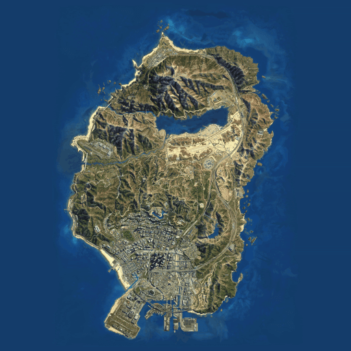

# Gta V map

This is the satellite map of Los Santos in the game GTA5, the map is displayed with [`leaflet.js`](https://leafletjs.com/) in a tile layer with 5 zoom levels to keep the resolution of the map as high as possible even when zoomed in.

There is a target location pre defined and the user can click any where and the distance between the two markers will be logged out on the console
